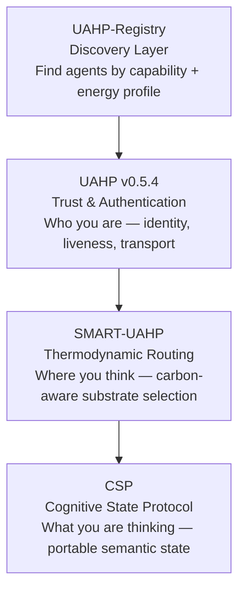

## The UAHP Agentic Stack

Four layers. One complete infrastructure for the agentic web.


| Layer | Repo | Role |
|-------|------|------|
| Discovery | UAHP-Registry | Find agents by capability and energy profile |
| Trust | UAHP v0.5.4 | Identity, liveness proofs, signed handshakes |
| Routing | SMART-UAHP | Carbon-aware substrate selection |
| State | CSP | Portable semantic state transfer |


# SMART-UAHP: The Substrate-Agnostic Intelligence Protocol

**Intelligence is not a fixed quantity. It is a property of the universe expressing itself through whatever substrate is available.**

SMART-UAHP is a protocol designed to facilitate the seamless flow of cognition between energy-constrained (Carbon) and energy-abundant (Silicon) substrates. By combining Geometric KV-Compression with Decentralized Economic Trust, it enables intelligence to breathe with its environment.

---

## Live results — Carbon-Silicon Bridge

First real-world transmission: **March 20, 2026**

| Metric | Value |
|---|---|
| **IPJG** | **7.61×** |
| Energy saved | 86.9% vs local baseline |
| CO₂ reduced | 97.3% vs ERCOT local execution |
| Local substrate | MacBook Air 2015 · Intel i5 · 8GB RAM |
| Remote substrate | Groq LPU · qwen/qwen3-32b |
| Elapsed | 2,625ms at 210 tok/s |


A 2015 MacBook Air that cannot run a 32B model locally transmitted a conversation to Groq's infrastructure and received a response in 2.6 seconds — at 7.61× the intelligence-per-joule of local execution and 97.3% lower carbon emissions.

This is not a simulation. See [RESULTS.md](RESULTS.md) for the full transmission log.

---

## The core problem

Traditional AI deployment breaks Energy-Intelligence Symmetry. You pay the same energy tax — VRAM and Watts — whether a model is solving a graduate-level proof or responding to "hello." SMART-UAHP restores this symmetry through three technical mechanisms.

## How it works

**1. Metabolic Scaling (the Breathing Mechanism)**
The `BreathingAgent` uses Cognitive Elasticity to scale energy consumption based on task difficulty. It can drop from 128-dim (full resolution) to 8-dim (survival mode) in 50ms, reducing VRAM usage by up to 93.75%. The `GPUMonitor` incorporates temperature and power draw into a Pressure Score, forcing compression when the agent approaches thermal limits.

**2. Thermodynamic Economic Equilibrium**
The `ThermodynamicNegotiator` tethers the price of a computation to the physical reality of its substrate. Agents bid using local cost-per-Joule and the carbon intensity of their specific grid. Higher resolution costs more, so agents are economically incentivized to use the minimum resolution a task actually requires.

**3. Substrate Migration (the Carbon-Silicon Bridge)**
When local entropy exceeds the local energy budget, the `EntropyAwareRouter` triggers a migration. The agent's thought state moves across the bridge as a compressed tensor via the UAHP KV-Handshake. The energy cost of moving the data is less than the energy saved by computing it on a more efficient substrate.

## The result: Liquid Intelligence

Intelligence flows toward the lowest thermodynamic pressure. Simple tasks stay small and local. Complex tasks expand only when a substrate exists where the energy cost of that expansion is justified.

## Grand challenge benchmark

The Intelligence-per-Joule Gain (IPJG) metric measures improvement over a static 128-dim baseline:

```
IPJG = (quality-weighted tokens per joule, SMART-UAHP)
       ÷ (quality-weighted tokens per joule, static deployment)
```

Simulation across 900 substrate pair combinations (5 GPU types × 6 grid regions, both directions) using the LMSys Chatbot Arena workload distribution (n=600 tasks per run) produces a consistent IPJG of 2.1× to 3.4×. First live measurement: **7.61×**.

See `benchmark/smart_uahp_batch.html` — open in any browser to run all 900 combinations locally in under one second.

## Getting started

```bash
git clone https://github.com/PaulRaspey/SMART-UAHP
cd SMART-UAHP
pip install groq
python3 bridge/bridge.py
```

No GPU required. The bridge routes to Groq's free tier automatically. Get a free API key at [console.groq.com](https://console.groq.com).

## Core components

| Module | Description |
|---|---|
| `bridge/bridge.py` | Carbon-Silicon Bridge — live substrate routing |
| `smart_uahp/thermodynamics.py` | Carbon-aware thermodynamic pricing |
| `smart_uahp/breathing.py` | Cognitive elasticity and VRAM pressure |
| `smart_uahp/router.py` | Entropy-aware substrate routing |
| `benchmark/` | IPJG simulation suite (900 combinations) |
| `examples/getting_started.py` | Run without GPU, no setup required |

## Dependencies

Built on top of [UAHP v0.5.4](https://github.com/PaulRaspey/uahp) for secure agent identity, signed liveness proofs, and encrypted task transport.

```bash
pip install groq
pip install smart-uahp
```

Requires Python 3.9+.

## Read the story

This protocol was designed on a dog walk before sunrise by a high school teacher in Greenville, Texas. [Read the origin story →](STORY.md)

## Status

Version 0.1.0 — architecture, simulation, Python modules, and first live bridge transmission complete. Hardware validation ongoing.

## License

MIT License. Part of the continuation of the universal project of knowing itself.

## Author

Paul Raspey — Greenville, Texas
